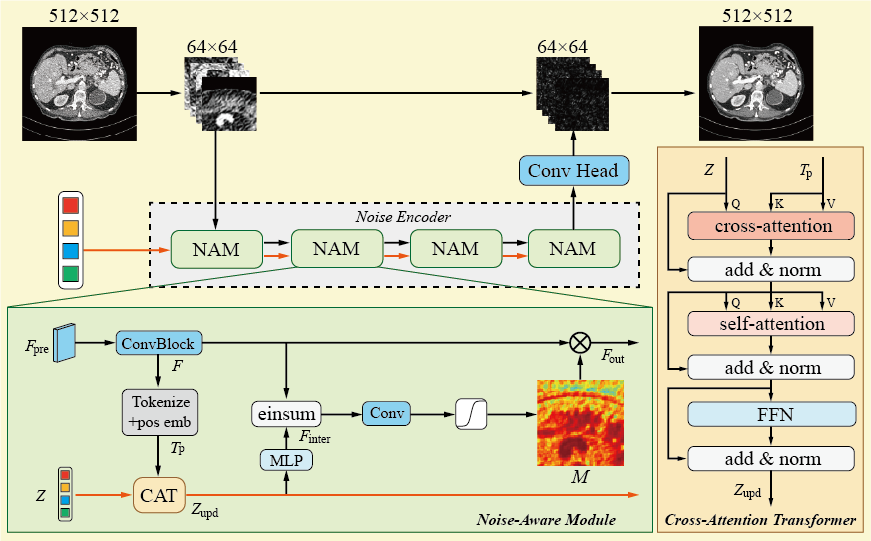
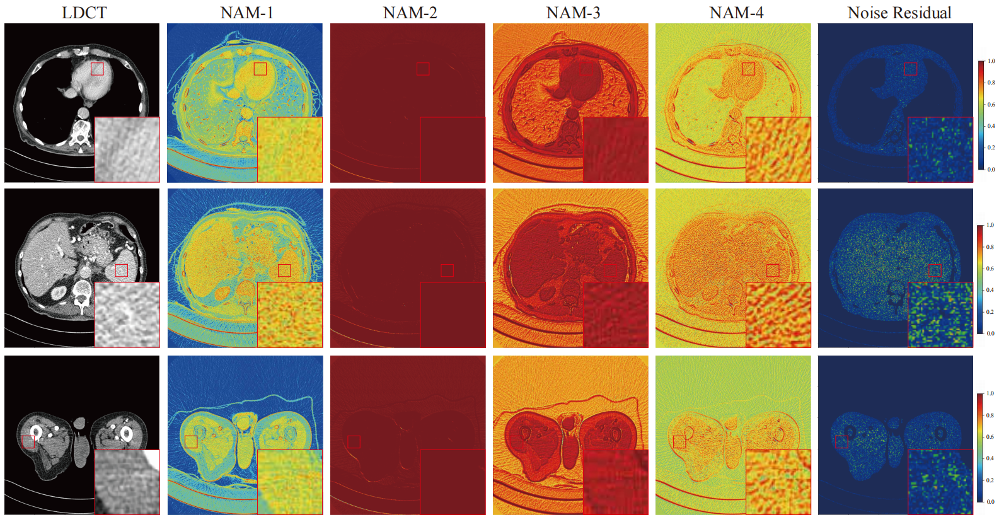

# Mask2Noise: Query-Driven Explicit Perception Framework for Balancing Fidelity and Efficiency in Low-dose CT Denoising

[**Paper**](LINK_TO_PAPER) | [**BibTeX**](#citation)

**Mask2Noise** is a lightweight explicit perception framework designed for low-dose CT image denoising. It utilizes learnable latent queries to achieve the progressive and differentiated learning of complex noise components, thereby establishing an optimal balance between structural fidelity and computational efficiency.

 Framework Structure 

## Evolution of Query-Driven Explicit Perception

 Visualization of the progressive cross-attention map evolution and magnified local regions of interest across the cascaded NAM blocks.

